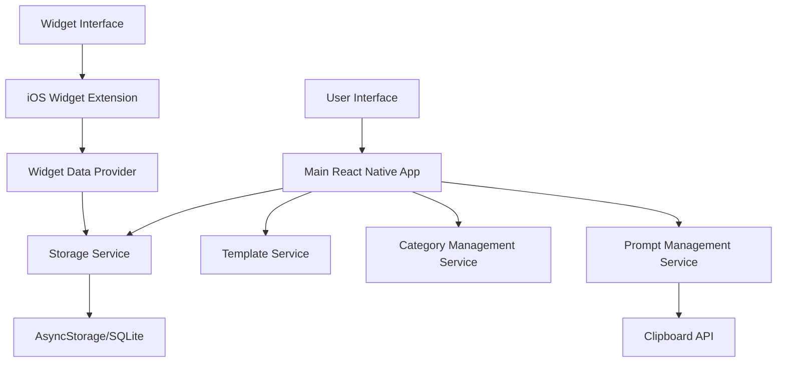

# Design Document

## Overview

The Prompt Manager App is a React Native/Expo iOS application designed to help users organize, store, and quickly access LLM prompts entirely offline. The app features a main application for full prompt management capabilities and a persistent iOS widget for quick prompt access. The architecture emphasizes exclusive local data storage with no external server communication, intuitive categorization, seamless clipboard integration, and complete offline functionality to ensure data privacy and security.

## Architecture

### High-Level Architecture



### Core Components

1. **Main Application**: React Native/Expo app with full CRUD functionality
2. **iOS Widget Extension**: Native iOS widget for quick prompt access
3. **Storage Layer**: Local data persistence using AsyncStorage or SQLite
4. **Service Layer**: Business logic for prompt, category, and template management
5. **UI Components**: Reusable React Native components for consistent interface

## Components and Interfaces

### Main Application Components

#### PromptManager
- **Purpose**: Central service for prompt CRUD operations
- **Key Methods**:
  - `createPrompt(content, type, category, templateId?)`
  - `updatePrompt(id, updates)`
  - `deletePrompt(id)`
  - `getPromptsByCategory(categoryId)`
  - `copyPromptToClipboard(promptId)`

#### CategoryManager
- **Purpose**: Manages task categories and organization
- **Key Methods**:
  - `createCategory(name, description)`
  - `getCategories()`
  - `updateCategory(id, updates)`
  - `deleteCategory(id)`

#### TemplateService
- **Purpose**: Manages prompt templates for different tasks
- **Key Methods**:
  - `getTemplatesByTask(taskType)`
  - `createCustomTemplate(structure)`
  - `applyTemplate(templateId, customData)`

#### StorageService
- **Purpose**: Handles local data persistence and retrieval with offline-first architecture
- **Key Methods**:
  - `saveData(key, data)`
  - `getData(key)`
  - `deleteData(key)`
  - `getAllPrompts()`
  - `getStorageUsage()`
  - `cleanupOldData()`
  - `validateStorageCapacity()`
  - `createBackup()`
  - `restoreBackup(backupData)`

### iOS Widget Components

#### WidgetDataProvider
- **Purpose**: Provides data to the iOS widget from shared storage
- **Key Methods**:
  - `getRecentPrompts(limit)`
  - `getPromptsByCategory(categoryId)`
  - `copyPromptToClipboard(promptId)`

#### WidgetView
- **Purpose**: Native iOS widget UI implementation
- **Features**:
  - Category-based prompt listing
  - Quick copy functionality
  - Compact prompt preview

## Data Models

### Prompt Model
```typescript
interface Prompt {
  id: string;
  title: string;
  content: string;
  type: 'system' | 'user' | 'assistant' | 'custom';
  categoryId: string;
  templateId?: string;
  createdAt: Date;
  updatedAt: Date;
  tags?: string[];
  isFavorite: boolean;
  size: number; // Content size in bytes for storage management
  lastAccessed: Date; // For cleanup and usage analytics
}
```

### Category Model
```typescript
interface Category {
  id: string;
  name: string;
  description?: string;
  color: string;
  icon?: string;
  createdAt: Date;
  updatedAt: Date;
  promptCount: number;
  totalSize: number; // Total storage size of prompts in this category
}
```

### Template Model
```typescript
interface Template {
  id: string;
  name: string;
  taskType: string;
  structure: TemplateField[];
  description?: string;
  isCustom: boolean;
  createdAt: Date;
  updatedAt: Date;
  usageCount: number; // Track template usage for analytics
}

interface TemplateField {
  id: string;
  label: string;
  type: 'text' | 'textarea' | 'select';
  placeholder?: string;
  required: boolean;
  options?: string[]; // for select type
}
```

## Error Handling

### Application-Level Error Handling
- **Storage Errors**: Robust fallback mechanisms for local data persistence failures
- **Validation Errors**: User-friendly error messages for invalid input with offline validation
- **Widget Errors**: Silent failure with fallback to main app functionality
- **Offline Operation**: Complete functionality without any network dependency
- **Storage Capacity**: Proactive monitoring and user notifications for storage limitations
- **Data Privacy**: Strict enforcement of no external data transmission

### Error Recovery Strategies
1. **Data Corruption**: Local backup and restore mechanisms using device storage
2. **Storage Full**: User-guided cleanup with storage usage analytics and warnings
3. **Widget Failure**: Graceful degradation to main app functionality
4. **Template Loading**: Fallback to free-form input
5. **Local Storage Failure**: Alternative storage mechanisms (AsyncStorage fallback to SQLite)
6. **Data Migration**: Seamless migration between storage systems if needed

## Testing Strategy

### Unit Testing
- **Services**: Test all CRUD operations and business logic
- **Components**: Test React Native component behavior and props
- **Data Models**: Validate data transformation and validation logic
- **Storage**: Test persistence and retrieval operations

### Integration Testing
- **App Flow**: Test complete user workflows from creation to clipboard copy in offline mode
- **Widget Integration**: Test secure local data sharing between main app and widget
- **Storage Integration**: Test local data consistency and persistence across app sessions
- **Template System**: Test template application and customization with local storage
- **Offline Functionality**: Comprehensive testing of all features without network connectivity
- **Storage Management**: Test storage capacity monitoring and cleanup mechanisms

### iOS-Specific Testing
- **Widget Functionality**: Test widget display and interaction on various iOS versions
- **Clipboard Integration**: Test clipboard operations across different iOS contexts
- **Background Behavior**: Test app behavior when backgrounded and resumed
- **Device Compatibility**: Test on different iOS device sizes and capabilities

### User Acceptance Testing
- **Workflow Testing**: Validate complete user scenarios
- **Performance Testing**: Ensure responsive UI and quick widget access
- **Usability Testing**: Verify intuitive navigation and prompt management
- **Accessibility Testing**: Ensure compliance with iOS accessibility standards

## Technical Implementation Notes

### React Native/Expo Considerations
- **Expo SDK**: Use Expo SDK 49+ for latest iOS compatibility
- **Native Modules**: Widget functionality requires custom native module or ejection from Expo managed workflow
- **Storage**: Prioritize local storage solutions - AsyncStorage for simple data, SQLite for complex queries and better performance
- **Navigation**: React Navigation 6 for screen management
- **Offline-First**: Design all components to work without network connectivity
- **No Network Dependencies**: Strictly avoid any external API calls or cloud services

### iOS Widget Implementation
- **Widget Extension**: Requires native iOS development (Swift/SwiftUI)
- **Shared Data**: Use App Groups for secure local data sharing between main app and widget
- **Widget Types**: Implement small, medium, and large widget sizes
- **Update Mechanism**: Timeline-based updates for widget content using only local data
- **Offline Widget**: Ensure widget functions completely offline with cached local data
- **Privacy Compliance**: Widget operates entirely with local device storage

### Performance Optimizations
- **Lazy Loading**: Load prompts on-demand for large collections from local storage
- **Local Caching**: Cache frequently accessed prompts and categories in device memory
- **Widget Efficiency**: Minimize widget update frequency to preserve battery while maintaining offline functionality
- **Memory Management**: Efficient cleanup of unused components and data
- **Storage Optimization**: Implement data compression and efficient local storage usage
- **Offline Performance**: Optimize for immediate response times without network latency
- **Storage Monitoring**: Proactive monitoring of local storage usage and cleanup recommendations