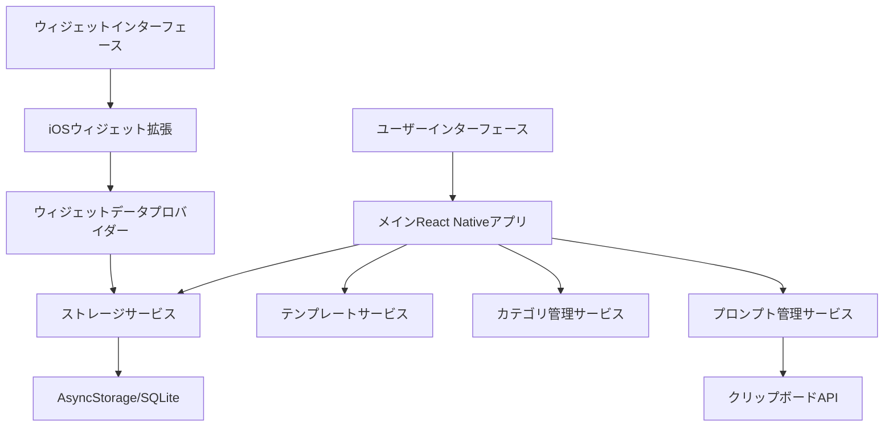

# 設計文書

## 概要

Prompt Manager Appは、ユーザーがLLMプロンプトを完全にオフラインで整理、保存、素早くアクセスできるよう設計されたReact Native/Expo iOSアプリケーションです。このアプリは、完全なプロンプト管理機能を持つメインアプリケーションと、素早いプロンプトアクセスのための永続的なiOSウィジェットを特徴としています。アーキテクチャは、外部サーバー通信を一切行わない排他的ローカルデータストレージ、直感的な分類、シームレスなクリップボード統合、データプライバシーとセキュリティを確保する完全なオフライン機能を重視しています。

## アーキテクチャ

### 高レベルアーキテクチャ



### コアコンポーネント

1. **メインアプリケーション**: 完全なCRUD機能を持つReact Native/Expoアプリ
2. **iOSウィジェット拡張**: 素早いプロンプトアクセスのためのネイティブiOSウィジェット
3. **ストレージレイヤー**: AsyncStorageまたはSQLiteを使用したローカルデータ永続化
4. **サービスレイヤー**: プロンプト、カテゴリ、テンプレート管理のためのビジネスロジック
5. **UIコンポーネント**: 一貫したインターフェースのための再利用可能なReact Nativeコンポーネント

## コンポーネントとインターフェース

### メインアプリケーションコンポーネント

#### PromptManager
- **目的**: プロンプトCRUD操作の中央サービス
- **主要メソッド**:
  - `createPrompt(content, type, category, templateId?)`
  - `updatePrompt(id, updates)`
  - `deletePrompt(id)`
  - `getPromptsByCategory(categoryId)`
  - `copyPromptToClipboard(promptId)`

#### CategoryManager
- **目的**: タスクカテゴリと組織の管理
- **主要メソッド**:
  - `createCategory(name, description)`
  - `getCategories()`
  - `updateCategory(id, updates)`
  - `deleteCategory(id)`

#### TemplateService
- **目的**: 異なるタスク用のプロンプトテンプレートの管理
- **主要メソッド**:
  - `getTemplatesByTask(taskType)`
  - `createCustomTemplate(structure)`
  - `applyTemplate(templateId, customData)`

#### StorageService
- **目的**: オフライン最優先アーキテクチャでのローカルデータ永続化と取得の処理
- **主要メソッド**:
  - `saveData(key, data)`
  - `getData(key)`
  - `deleteData(key)`
  - `getAllPrompts()`
  - `getStorageUsage()`
  - `cleanupOldData()`
  - `validateStorageCapacity()`
  - `createBackup()`
  - `restoreBackup(backupData)`

### iOSウィジェットコンポーネント

#### WidgetDataProvider
- **目的**: 共有ストレージからiOSウィジェットにデータを提供
- **主要メソッド**:
  - `getRecentPrompts(limit)`
  - `getPromptsByCategory(categoryId)`
  - `copyPromptToClipboard(promptId)`

#### WidgetView
- **目的**: ネイティブiOSウィジェットUI実装
- **機能**:
  - カテゴリベースのプロンプトリスト
  - クイックコピー機能
  - コンパクトなプロンプトプレビュー
  - 複数サイズ対応（小・中・大）
  - カスタマイズ可能なレイアウト

#### WidgetConfigurationService
- **目的**: ウィジェット設定とカスタマイズ管理
- **主要メソッド**:
  - `setWidgetSize(size)`
  - `configureDisplayContent(categories, promptCount)`
  - `setPriorityPrompts(promptIds)`
  - `updateWidgetSettings(settings)`
  - `getWidgetConfiguration()`

## データモデル

### Promptモデル
```typescript
interface Prompt {
  id: string;
  title: string;
  content: string;
  type: 'system' | 'user' | 'assistant' | 'custom';
  categoryId: string;
  templateId?: string;
  createdAt: Date;
  updatedAt: Date;
  tags?: string[];
  isFavorite: boolean;
  size: number; // ストレージ管理のためのコンテンツサイズ（バイト）
  lastAccessed: Date; // クリーンアップと使用状況分析のため
}
```

### Categoryモデル
```typescript
interface Category {
  id: string;
  name: string;
  description?: string;
  color: string;
  icon?: string;
  createdAt: Date;
  updatedAt: Date;
  promptCount: number;
  totalSize: number; // このカテゴリ内のプロンプトの総ストレージサイズ
}
```

### Templateモデル
```typescript
interface Template {
  id: string;
  name: string;
  taskType: string;
  structure: TemplateField[];
  description?: string;
  isCustom: boolean;
  createdAt: Date;
  updatedAt: Date;
  usageCount: number; // 分析のためのテンプレート使用状況追跡
}

interface TemplateField {
  id: string;
  label: string;
  type: 'text' | 'textarea' | 'select';
  placeholder?: string;
  required: boolean;
  options?: string[]; // select型用
}
```

### WidgetConfigurationモデル
```typescript
interface WidgetConfiguration {
  id: string;
  size: 'small' | 'medium' | 'large';
  displayCategories: string[]; // 表示するカテゴリID
  maxPrompts: number; // 表示する最大プロンプト数
  priorityPrompts: string[]; // 優先表示するプロンプトID
  showRecentPrompts: boolean; // 最近使用したプロンプトを表示するか
  refreshInterval: number; // 更新間隔（秒）
  createdAt: Date;
  updatedAt: Date;
}
```

## エラーハンドリング

### アプリケーションレベルのエラーハンドリング
- **ストレージエラー**: ローカルデータ永続化失敗に対する堅牢なフォールバックメカニズム
- **検証エラー**: オフライン検証での無効な入力に対するユーザーフレンドリーなエラーメッセージ
- **ウィジェットエラー**: メインアプリ機能へのフォールバックを伴うサイレント失敗
- **オフライン動作**: ネットワーク依存なしの完全な機能
- **ストレージ容量**: ストレージ制限の積極的な監視とユーザー通知
- **データプライバシー**: 外部データ送信の厳格な禁止

### エラー復旧戦略
1. **データ破損**: デバイスストレージを使用したローカルバックアップと復元メカニズム
2. **ストレージ満杯**: ストレージ使用状況分析と警告を伴うユーザー主導のクリーンアップ
3. **ウィジェット失敗**: メインアプリ機能への優雅な劣化
4. **テンプレート読み込み**: 自由形式入力へのフォールバック
5. **ローカルストレージ失敗**: 代替ストレージメカニズム（AsyncStorageからSQLiteへのフォールバック）
6. **データ移行**: 必要に応じたストレージシステム間のシームレスな移行

## テスト戦略

### 単体テスト
- **サービス**: すべてのCRUD操作とビジネスロジックのテスト
- **コンポーネント**: React Nativeコンポーネントの動作とpropsのテスト
- **データモデル**: データ変換と検証ロジックの検証
- **ストレージ**: 永続化と取得操作のテスト

### 統合テスト
- **アプリフロー**: オフラインモードでの作成からクリップボードコピーまでの完全なユーザーワークフローのテスト
- **ウィジェット統合**: メインアプリとウィジェット間のセキュアなローカルデータ共有のテスト
- **ストレージ統合**: アプリセッション間でのローカルデータ整合性と永続性のテスト
- **テンプレートシステム**: ローカルストレージでのテンプレート適用とカスタマイズのテスト
- **オフライン機能**: ネットワーク接続なしでのすべての機能の包括的テスト
- **ストレージ管理**: ストレージ容量監視とクリーンアップメカニズムのテスト
- **ExpoGo互換性**: ExpoGo環境での基本機能とローカルストレージ機能のテスト
- **段階的機能**: ExpoGo制限事項と代替手段の検証テスト

### iOS固有テスト
- **ウィジェット機能**: 様々なiOSバージョンでのウィジェット表示と相互作用のテスト
- **クリップボード統合**: 異なるiOSコンテキストでのクリップボード操作のテスト
- **バックグラウンド動作**: バックグラウンド化と復帰時のアプリ動作のテスト
- **デバイス互換性**: 異なるiOSデバイスサイズと機能でのテスト

### ユーザー受け入れテスト
- **ワークフローテスト**: 完全なユーザーシナリオの検証
- **パフォーマンステスト**: レスポンシブなUIと素早いウィジェットアクセスの確保
- **ユーザビリティテスト**: 直感的なナビゲーションとプロンプト管理の検証
- **アクセシビリティテスト**: iOSアクセシビリティ標準の準拠確保

## 技術実装ノート

### React Native/Expoの考慮事項
- **Expo SDK**: 最新のiOS互換性のためにExpo SDK 49+を使用
- **ExpoGo開発**: 開発・テスト段階ではExpoGoでの実行互換性を優先
- **ネイティブモジュール**: ウィジェット機能にはカスタムネイティブモジュールまたはExpo管理ワークフローからの分離が必要
- **ストレージ**: ローカルストレージソリューションを優先 - 簡単なデータにはAsyncStorage、複雑なクエリとより良いパフォーマンスにはSQLite
- **ナビゲーション**: 画面管理にReact Navigation 6
- **オフライン最優先**: すべてのコンポーネントをネットワーク接続なしで動作するよう設計
- **ネットワーク依存なし**: 外部API呼び出しやクラウドサービスを厳格に回避
- **段階的開発**: ExpoGo → ネイティブビルドの段階的開発アプローチ

### iOSウィジェット実装
- **ウィジェット拡張**: ネイティブiOS開発（Swift/SwiftUI）が必要
- **共有データ**: メインアプリとウィジェット間のセキュアなローカルデータ共有にApp Groupsを使用
- **ウィジェットタイプ**: 小、中、大のウィジェットサイズを実装
- **更新メカニズム**: ローカルデータのみを使用したウィジェットコンテンツのタイムラインベース更新
- **オフラインウィジェット**: キャッシュされたローカルデータで完全にオフラインで機能するウィジェットを確保
- **プライバシー準拠**: ウィジェットは完全にローカルデバイスストレージで動作
- **高度なカスタマイズ**: ユーザー設定に基づく動的レイアウトとコンテンツ表示
- **設定同期**: メインアプリでの設定変更の即座のウィジェット反映
- **画面ロック対応**: デバイスロック状態でのプロンプトアクセス機能

### パフォーマンス最適化
- **遅延読み込み**: ローカルストレージから大きなコレクションのプロンプトをオンデマンドで読み込み
- **ローカルキャッシュ**: 頻繁にアクセスされるプロンプトとカテゴリをデバイスメモリにキャッシュ
- **ウィジェット効率**: オフライン機能を維持しながらバッテリーを節約するためウィジェット更新頻度を最小化
- **メモリ管理**: 未使用のコンポーネントとデータの効率的なクリーンアップ
- **ストレージ最適化**: データ圧縮と効率的なローカルストレージ使用の実装
- **オフラインパフォーマンス**: ネットワーク遅延なしの即座の応答時間の最適化
- **ストレージ監視**: ローカルストレージ使用状況の積極的な監視とクリーンアップ推奨
